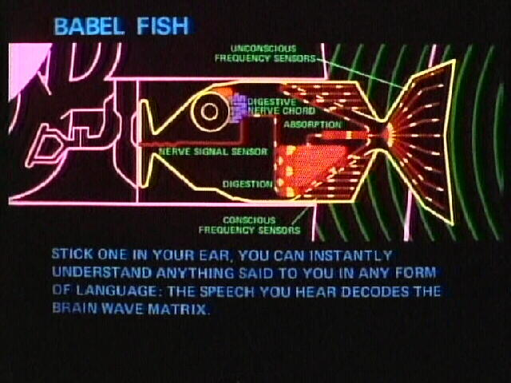

################################
BabelScan
################################

.. rubric:: BabelScan: A format independent structure for scan data

:Author: Dan Porter
:Contact: dan.porter (at) diamond (dot) ac (dot) uk
:Website: https://github.com/DanPorter/babelscan

BabelScan documentation
=======================

BabelScan is a format independent data structure for holding different types of data from a scan file.
You don't even need to put it in your ear!

.. code-block:: python

    import babelscan
    scan = babelscan.file_loader('12345.nxs')

.. toctree::
   :maxdepth: 2
   :caption: Contents:

   Installation
   Usage
   code/Code
   plotting/Plotting
   fitting/Fitting

Indices and tables
==================

* :ref:`genindex`
* :ref:`modindex`
* :ref:`search`
